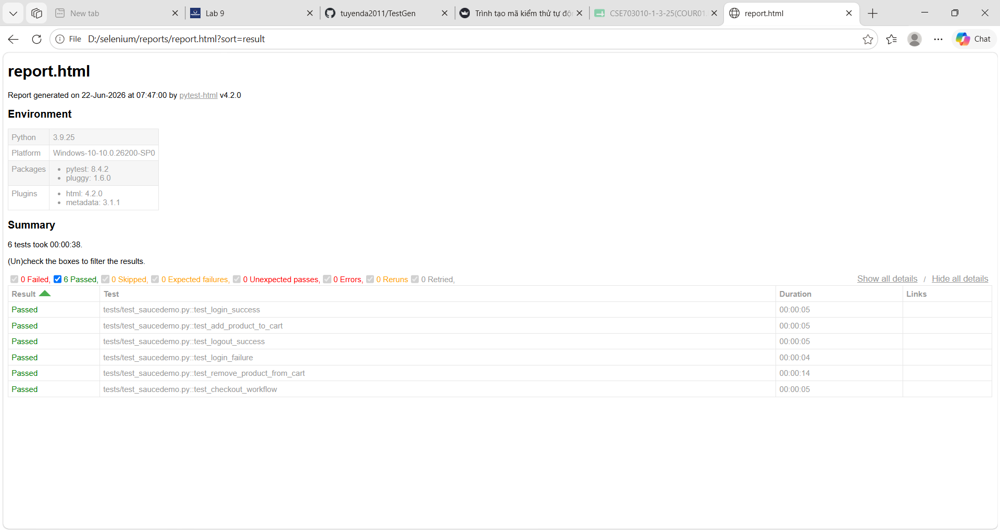

# Selenium Automation Testing Practice

## 1. Thông tin bài làm
- Công cụ thực hành: Selenium WebDriver
- Ngôn ngữ lập trình: Python
- Framework test: pytest
- Website kiểm thử: https://www.saucedemo.com/
- Người thực hiện: Đặng Anh Tuyền
- Mã sinh viên: 23010912

## 2. Mục tiêu

Bài thực hành này sử dụng Selenium để xây dựng các test case kiểm thử tự động cho website SauceDemo.  
Mục tiêu là kiểm tra một số chức năng cơ bản của website như đăng nhập, thêm sản phẩm vào giỏ hàng và đăng xuất.

## 3. Công nghệ sử dụng

- Python
- Selenium WebDriver
- pytest
- pytest-html
- Microsoft Edge

## 4. Cấu trúc thư mục

```text
selenium-practice/
├── tests/
│   ├── conftest.py
│   └── test_saucedemo.py
├── reports/
├── .gitignore
├── pytest.ini
├── requirements.txt
└── README.md
```

## 5. Danh sách test case

| Mã test case | Tên test case | Mô tả | Kết quả mong đợi |
|---|---|---|---|
| TC01 | Đăng nhập thành công | Nhập username và password hợp lệ, sau đó bấm Login | Người dùng được chuyển đến trang Products |
| TC02 | Thêm sản phẩm vào giỏ hàng | Đăng nhập, chọn sản phẩm Sauce Labs Backpack và thêm vào giỏ hàng | Giỏ hàng hiển thị số lượng 1 và sản phẩm có trong cart |
| TC03 | Đăng xuất thành công | Đăng nhập, mở menu và bấm Logout | Người dùng quay về màn hình đăng nhập |
| TC04 | Đăng nhập thất bại | Nhập username nhưng sai password, sau đó bấm Login | Hiển thị thông báo lỗi "Username and password do not match" |
| TC05 | Xóa sản phẩm khỏi giỏ hàng | Thêm sản phẩm vào giỏ, sau đó bấm nút Remove | Số lượng hiển thị trên icon giỏ hàng biến mất |
| TC06 | Quy trình thanh toán | Thêm sản phẩm, đi tới trang thanh toán, nhập thông tin và Continue | Chuyển trang xác nhận và hiển thị tổng tiền (Total) |

## 6. Cách cài đặt và chạy project

### Bước 1: Cài thư viện cần thiết

```bash
pip install -r requirements.txt
```

Lưu ý: Máy cần cài sẵn trình duyệt Microsoft Edge. Selenium 4 sẽ tự quản lý EdgeDriver bằng Selenium Manager nên thường không cần tải driver thủ công.

### Bước 2: Chạy test

```bash
pytest
```

### Bước 3: Xuất báo cáo HTML

```bash
pytest --html=reports/report.html --self-contained-html
```

Sau khi chạy lệnh trên, mở file sau để xem báo cáo:

```text
reports/report.html
```

## 7. Mô tả quá trình thực hiện

Đầu tiên, em tìm hiểu Selenium WebDriver và cách điều khiển trình duyệt bằng Python.  
Sau đó, em tạo project Python, cài đặt các thư viện Selenium, pytest và pytest-html.  
Tiếp theo, em xây dựng các test case tự động cho website SauceDemo.  
Các test case được viết trong file `tests/test_saucedemo.py`, còn phần khởi tạo trình duyệt Microsoft Edge được đặt trong file `tests/conftest.py`.

## 8. Kết quả kiểm thử

Sau khi chạy lệnh `pytest`, các test case đều được thực thi tự động trên trình duyệt Microsoft Edge.

| Mã test case | Kết quả |
|---|---|
| TC01 | Passed |
| TC02 | Passed |
| TC03 | Passed |
| TC04 | Passed |
| TC05 | Passed |
| TC06 | Passed |

## 9. Hình ảnh minh họa



Sinh viên có thể chụp thêm các hình ảnh sau và đưa vào README:

- Ảnh cấu trúc project trên VS Code
- Ảnh chạy lệnh `pytest`
- Ảnh file báo cáo `reports/report.html`
- Ảnh repository sau khi upload lên GitHub

## 10. Kết luận

Qua bài thực hành này, em đã hiểu cách sử dụng Selenium để tự động hóa thao tác trên trình duyệt.  
Em cũng biết cách viết test case bằng pytest, chạy kiểm thử tự động và xuất báo cáo kiểm thử bằng pytest-html.  
Selenium là công cụ hữu ích trong kiểm thử phần mềm, đặc biệt đối với kiểm thử chức năng giao diện web.
